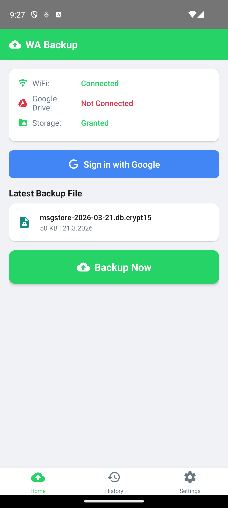
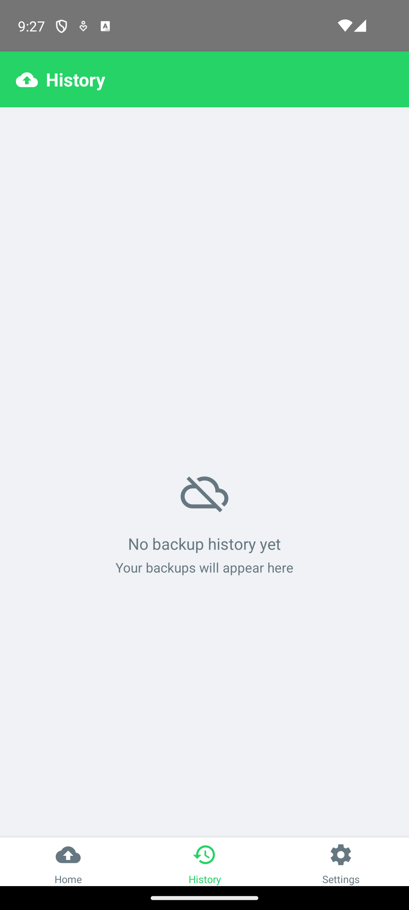
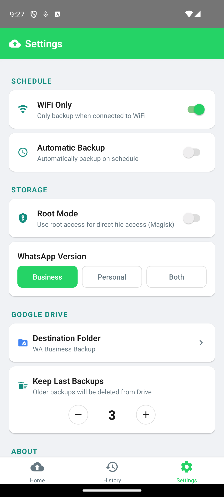

<p align="center">
  
</p>

<h1 align="center">WA Backup</h1>

<p align="center">
  Automatic WhatsApp backup to Google Drive for Android<br/>
  Supports Business & Personal, scheduled backups, progress notifications, and retention management
</p>

<p align="center">
  <a href="https://github.com/yaniv1983/wa-backup/releases/latest"></a>
  <a href="LICENSE"></a>
</p>

---

## Quick Start (Users)

1. Download the latest APK from the [Releases page](https://github.com/yaniv1983/wa-backup/releases/latest)
2. Install on your Android device
3. Follow the setup wizard — sign in to Google and grant storage access
4. That's it! Tap **Backup Now** or enable automatic scheduled backups

No Google Cloud setup required — the app works out of the box.

## Features

- **Manual & Automatic Backup** - Back up on demand or schedule daily/weekly at a specific time
- **Google Drive Integration** - Uploads to a dedicated Drive folder with chunked, resumable uploads
- **WhatsApp Business & Personal** - Supports both variants (or both simultaneously)
- **Exact-Time Scheduling** - Uses Android AlarmManager for reliable daily backups, survives reboots
- **Progress Notifications** - Real-time upload progress bar in the notification shade
- **Backup Retention** - Automatically deletes old backups in Drive (configurable count)
- **WiFi-Only Mode** - Option to only back up when connected to WiFi
- **Root Mode** - Optional root access for direct database file access
- **Retry with Backoff** - Failed uploads retry up to 3 times with exponential backoff
- **Backup History** - View past backups with status, size, and timestamps
- **Setup Wizard** - First-run onboarding guides you through sign-in and permissions

## Screenshots

<p align="center">
  
  &nbsp;&nbsp;
  
  &nbsp;&nbsp;
  
</p>

---

## Building from Source (Developers)

If you want to build the app yourself with your own signing key, you'll need to set up your own Google OAuth credentials.

### Prerequisites

- Node.js 18+
- React Native CLI
- Android Studio with SDK 34
- JDK 17

### Google Cloud Setup

1. Go to [Google Cloud Console](https://console.cloud.google.com/)
2. Create a new project (or select existing)
3. Enable the **Google Drive API**
4. Go to **Credentials** > **Create Credentials** > **OAuth 2.0 Client ID**
5. Create a **Web application** client — copy the Client ID
6. Create an **Android** client:
   - Package name: `com.wabackup`
   - SHA-1: Get it by running:
     ```bash
     cd android && ./gradlew signingReport
     ```

### Build & Run

```bash
git clone https://github.com/yaniv1983/wa-backup.git
cd wa-backup
npm install
npx react-native run-android
```

After installing, go to **Settings → Developer** in the app and paste your Web Client ID.

### Release APK

```bash
cd android
./gradlew assembleRelease
```

The APK will be at `android/app/build/outputs/apk/release/app-release.apk`.

## Project Structure

```
src/
├── config.ts                    # Default OAuth client ID
├── theme.ts                     # Colors, spacing, border radius
├── types/
│   └── index.ts                 # TypeScript interfaces & defaults
├── screens/
│   ├── SetupWizard.tsx          # First-run onboarding wizard
│   ├── HomeScreen.tsx           # Main screen - status, backup button, file list
│   ├── HistoryScreen.tsx        # Backup history with pull-to-refresh
│   └── SettingsScreen.tsx       # Schedule, storage, Drive, developer settings
└── services/
    ├── alarmSchedulerService.ts # JS wrapper for native AlarmManager module
    ├── backgroundService.ts     # Start/stop background backup scheduling
    ├── backupManager.ts         # Core backup orchestration with retry logic
    ├── fileService.ts           # WhatsApp file discovery (business/personal)
    ├── googleDriveService.ts    # Google Sign-In, chunked upload, retention
    ├── headlessBackupTask.ts    # Headless JS task for background execution
    ├── networkService.ts        # WiFi connectivity checks
    ├── notificationService.ts   # Upload progress & status notifications
    └── permissionService.ts     # Android permission requests
```

## Permissions

| Permission | Purpose |
|------------|---------|
| `INTERNET` | Google Drive API communication |
| `READ_EXTERNAL_STORAGE` | Access WhatsApp backup files |
| `MANAGE_EXTERNAL_STORAGE` | Android 11+ scoped storage access |
| `POST_NOTIFICATIONS` | Upload progress & backup status (Android 13+) |
| `SCHEDULE_EXACT_ALARM` | Precise daily backup scheduling |
| `RECEIVE_BOOT_COMPLETED` | Reschedule alarms after reboot |
| `ACCESS_NETWORK_STATE` | WiFi-only backup check |
| `FOREGROUND_SERVICE` | Background backup execution |
| `WAKE_LOCK` | Keep device awake during backup |

## Privacy Policy

[Read the full privacy policy](PRIVACY_POLICY.md). In short: the app does not collect, store, or transmit any personal data. Everything stays on your device and your Google Drive.

## License

[MIT](LICENSE)
